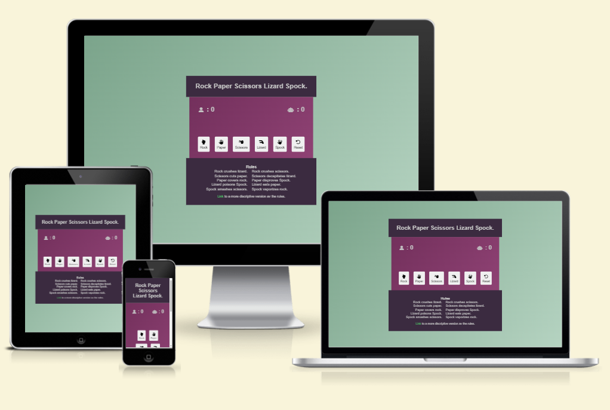

# [LIZARD SPOCK CI 2023 FSD P2 JS](https://zakenaio.github.io/Lizard-Spock-ci-2023-fsd-p2-js)

The wonderful world of pop-culture games. 
Rock Paper Scissors Lizard Spock was made famous in the show The Big Bang Theory, and is definitely perfect for a thing like this. 

RULES  
- https://www.wikihow.com/Play-Rock-Paper-Scissors-Lizard-Spock

The live link can be found [here](https://zakenaio.github.io/Lizard-Spock-ci-2023-fsd-p2-js)

## UX

I opted for an easy to understand UX, with only the necessities. 
Icons representing the User and Computer next to its Bolder score. 

Icons and text on all the buttons for easy navigation. 

### Colour Scheme

Colors were picked to make a high contrast, and slightly alien feel. Slight gradient on both
the greenish background and the main Game Content area to not be too stale. 

- `#009FE3` Primary text color.
- `#7ba48b` Background gradient top left.
- `#b5d3c1` Background gradient bottom right.
- `#3b2b40` Background header and Rules.
- `#73305c` Background Content gradient top left.
- `#8f4274` Background Content gradient bottom right.
- `#4ec466` Link color to make it pop. 

### Typography

Chose Arial, it's available on all platforms, and looks relatively modern. 

Icons for User, Computer and all the buttons are from Font Awesome.

- [Font Awesome](https://fontawesome.com) icons were used throughout the site. 

## Wireframes

Wireframe with explanation of my process. 

## Features

- **Whole site.**

    - Site built to fit on any modern screen. Inviting colors in high contrast.

- **Header**

    - Straight to the point header with only the title. 

- **Rules / Footer**

    - Details about this particular feature, including the value to the site, and benefit for the user. Be as detailed as possible!

- **Buttons**

    - Buttons have fitting icons for their function. Reset button was added to reset scores after a crushing defeat.

## Tools & Technologies Used

- [HTML](https://en.wikipedia.org/wiki/HTML) used for the main site content.
- [CSS](https://en.wikipedia.org/wiki/CSS) used for the main site design and layout.
- [CSS Flexbox](https://www.w3schools.com/css/css3_flexbox.asp) used for an enhanced responsive layout.
- [JavaScript](https://www.javascript.com) used for user interaction on the site.
- [Git](https://git-scm.com) used for version control. (`git add`, `git commit`, `git push`)
- [GitHub](https://github.com) used for secure online code storage.
- [GitHub Pages](https://pages.github.com) used for hosting the deployed front-end site.
- [VScode](https://code.visualstudio.com/) used for local development.
- [JSHint](https://jshint.com/) used for JavaSctipt testing. 

## Testing

For all testing, please refer to the [TESTING.md](TESTING.md) file.

## Deployment

The site was deployed to GitHub Pages. The steps to deploy are as follows:

- In the [GitHub repository](https://github.com/zakenaio/Lizard-Spock-ci-2023-fsd-p2-js), navigate to the Settings tab 
- From the source section drop-down menu, select the **Main** Branch, then click "Save".
- The page will be automatically refreshed with a detailed ribbon display to indicate the successful deployment.

The live link can be found [here](https://zakenaio.github.io/Lizard-Spock-ci-2023-fsd-p2-js)

### Local Deployment

This project can be cloned or forked in order to make a local copy on your own system.

#### Cloning

You can clone the repository by following these steps:

1. Go to the [GitHub repository](https://github.com/zakenaio/Lizard-Spock-ci-2023-fsd-p2-js) 
2. Locate the Code button above the list of files and click it 
3. Select if you prefer to clone using HTTPS, SSH, or GitHub CLI and click the copy button to copy the URL to your clipboard
4. Open Git Bash or Terminal
5. Change the current working directory to the one where you want the cloned directory
6. In your IDE Terminal, type the following command to clone my repository:
	- `git clone https://github.com/zakenaio/Lizard-Spock-ci-2023-fsd-p2-js.git`
7. Press Enter to create your local clone.

Alternatively, if using Gitpod, you can click below to create your own workspace using this repository.

Please note that in order to directly open the project in Gitpod, you need to have the browser extension installed.
A tutorial on how to do that can be found [here](https://www.gitpod.io/docs/configure/user-settings/browser-extension).

#### Forking

By forking the GitHub Repository, we make a copy of the original repository on our GitHub account to view and/or make changes without affecting the original owner's repository.
You can fork this repository by using the following steps:

1. Log in to GitHub and locate the [GitHub Repository](https://github.com/zakenaio/Lizard-Spock-ci-2023-fsd-p2-js)
2. At the top of the Repository (not top of the page) just above the "Settings" Button on the menu, locate the "Fork" Button.
3. Once clicked, you should now have a copy of the original repository in your own GitHub account!

## Credits

RULES 
All of the rules with images and proper descriptions found [HERE](https://www.wikihow.com/Play-Rock-Paper-Scissors-Lizard-Spock)

I found some info on how to use arrays instead of IF/ELSE. 
And it made the code so much easier. found [HERE](https://learnersbucket.com/tutorials/js-projects/rock-paper-scissor-lizard-spock-game-in-javascript/)

Favicon was found [HERE](https://www.flaticon.com/free-icon/vulcan-salute_4763373?term=spock&page=1&position=1&origin=tag&related_id=4763373)

More sources I have looked at to understand the process and functions. 
All three sites have been important to understand how to use functions 
all in their own right. 
- https://learnersbucket.com/tutorials/js-projects/rock-paper-scissor-lizard-spock-game-in-javascript/

- https://stackoverflow.com/questions/22623331/rock-paper-scissors-lizard-spock-in-javascript

- https://codereview.stackexchange.com/questions/102057/rock-paper-scissors-lizard-and-spock

JavaScript sources I have used.  
- https://stackoverflow.com/questions/6348494/addeventlistener-vs-onclick

- https://stackoverflow.com/questions/49075769/addeventlistener-for-domcontentloaded-is-not-working

- https://developer.mozilla.org/en-US/docs/Web/Events/Event_handlers

- https://developer.mozilla.org/en-US/docs/Web/API/EventTarget/addEventListener

JavaScript - Understanding forEach. 
I struggled with making one function to handle all player-buttons. This pointed me in the right direction.
- https://www.w3schools.com/jsref/jsref_forEach.asp
- https://developer.mozilla.org/en-US/docs/Web/JavaScript/Reference/Global_Objects/Array/forEach

### Content

| Source | Location | Notes |
| --- | --- | --- |
| [Markdown Builder](https://tim.2bn.dev/markdown-builder) | README and TESTING | tool to help generate the Markdown files |

### Acknowledgements

- I would like to thank my Code Institute mentor, [Tim Nelson](https://github.com/TravelTimN) for their support throughout the development of this project.
- I would like to thank my Code Institute mentor, [Julia Konovalova](https://github.com/IuliiaKonovalova) for their support throughout the development of this project.
- I would like to thank the [Code Institute](https://codeinstitute.net) tutor team for their assistance with troubleshooting and debugging some project issues.
- I would like to thank the [Code Institute Slack community](https://code-institute-room.slack.com) for the moral support; it kept me going during periods of self doubt and imposter syndrome.
