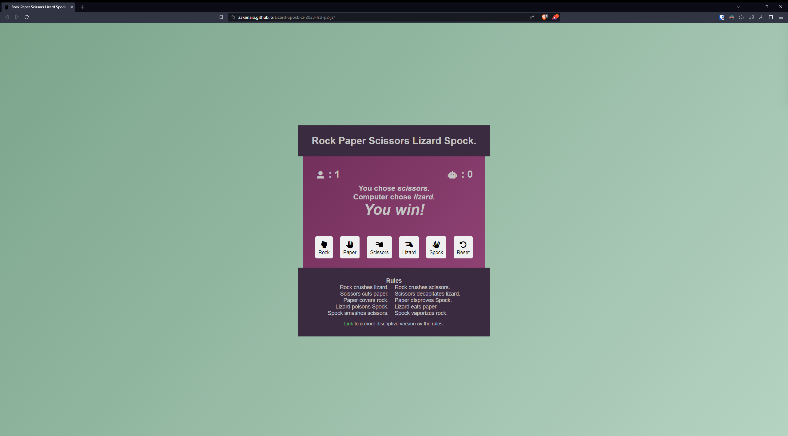
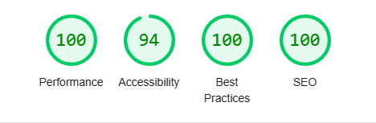

# Testing

Return back to the [README.md](README.md) file.

## Code Validation

### HTML

I have used the recommended [HTML W3C Validator](https://validator.w3.org) to validate all of my HTML files.

- https://validator.w3.org/nu/?doc=https%3A%2F%2Fzakenaio.github.io%2FLizard-Spock-ci-2023-fsd-p2-js%2Findex.html

### CSS

I have used the recommended [CSS Jigsaw Validator](https://jigsaw.w3.org/css-validator) to validate all of my CSS files.

Here we find a problem, the text-wrap: balance feature. 
It's supported in all but Safari so far, but on unsupported devices 
it just defaults to normal. 

text-wrap: balance

not using - text-wrap: balance

#### Use of text-wrap: balance
Here is where i found the initial idea.
- https://stackoverflow.com/questions/2908697/balanced-text-wrapping-in-html

Here are information from developers.Google
- https://developer.chrome.com/blog/css-text-wrap-balance/

Here are information from developers.Mozilla
- https://developer.mozilla.org/en-US/docs/Web/CSS/text-wrap

Link for testing of the live site.
- https://jigsaw.w3.org/css-validator/validator?uri=https%3A%2F%2Fzakenaio.github.io%2FLizard-Spock-ci-2023-fsd-p2-js%2F&profile=css3svg&usermedium=all&warning=1&vextwarning=&lang=sv  

### JavaScript

I have used the recommended [JShint Validator](https://jshint.com) to validate all of my JS files.

It says here that there are two functions not in use. 
The playerChoice - Triggered by the buttons Rock / Paper / Scissors / Lizard / Spock.
The resetGame - Triggered by the reset button.

## Browser Compatibility

I've tested my deployed project on multiple browsers to check for compatibility issues.

| Browser |  |
| --- | --- |
| Firefox |  | 
| Edge |  | 
| Safari |  | 
| Brave |  | 

## Responsiveness

I've tested my deployed project on multiple devices to check for responsiveness issues.

| Device | DevTools | On Device |
| --- | --- | --- |
| Mobile  |  |  |
| Tablet  |  |  |
| Desktop |  |  |  

## Lighthouse Audit

I've tested my deployed project using the Lighthouse Audit tool to check for any major issues.

| Page | Mobile | Desktop |
| --- | --- | --- |
| Home |  |  |

## Bugs.

None, that I know of. 