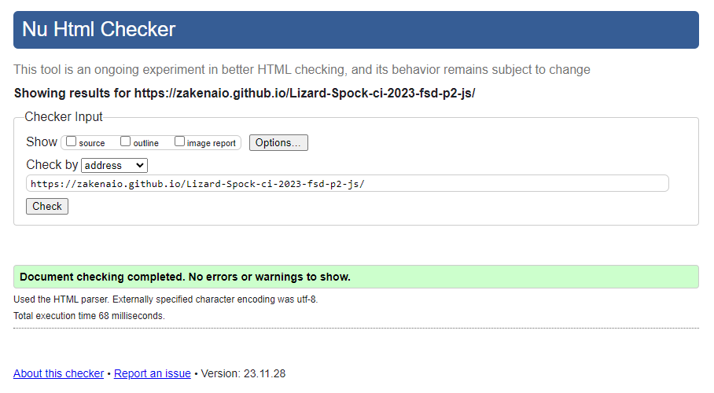
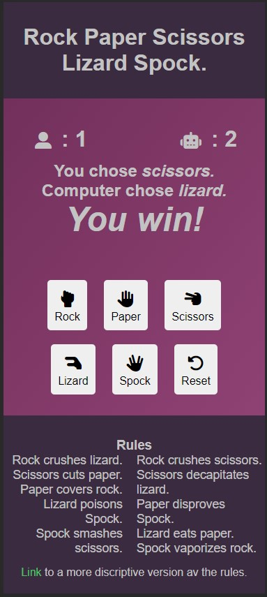
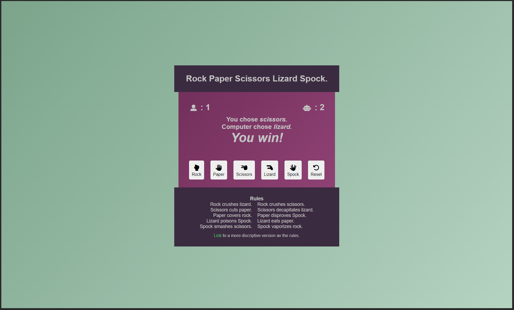

# Testing

Return back to the [README.md](README.md) file.

## Code Validation

### HTML

I have used the recommended [HTML W3C Validator](https://validator.w3.org) to validate all of my HTML files.

- https://validator.w3.org/nu/?doc=https%3A%2F%2Fzakenaio.github.io%2FLizard-Spock-ci-2023-fsd-p2-js%2Findex.html

### CSS

I have used the recommended [CSS Jigsaw Validator](https://jigsaw.w3.org/css-validator) to validate all of my CSS files.

Link for testing of the live site.
- https://jigsaw.w3.org/css-validator/validator?uri=https%3A%2F%2Fzakenaio.github.io%2FLizard-Spock-ci-2023-fsd-p2-js%2F&profile=css3svg&usermedium=all&warning=1&vextwarning=&lang=sv  

### JavaScript

I have used the recommended [JShint Validator](https://jshint.com) to validate all of my JS files.

## Browser Compatibility

I've tested my deployed project on multiple browsers to check for compatibility issues.

| Browser |  |
| --- | --- |
| Brave |  | 
| | Works as expected |
| Edge |  | 
| | Works as expected |
| Safari macOS |  |
| | Here the reset button is by itself, will see if i can find a solution. |
| Firefox macOS |  |
| | Here the reset button is by itself, will see if i can find a solution. |

## Responsiveness

I've tested my deployed project on multiple devices to check for responsiveness issues.

| Device | DevTools | On Device |
| --- | --- | --- |
| Mobile  |  |  |
| Tablet  |  |  |
| Desktop |  |  |  

## Test of functions in console

## Lighthouse Audit

I've tested my deployed project using the Lighthouse Audit tool to check for any major issues.

| Page | Mobile | Desktop |
| --- | --- | --- |
| Home |  |  |

## Bugs.

### Solved bug
Found some bugs with the styling with overflow. small screen horizontal overflowsss 
The fix was :
`
    * {
        box-sizing: border-box;
        margin: 0;
        padding: 0;
    }
`
And in the body :
`
     width: 100% !important;
`

On mac in Safari and FireFox the Reset button was on a new line underneath the 
Game-buttons. Doesnt affect the game. 